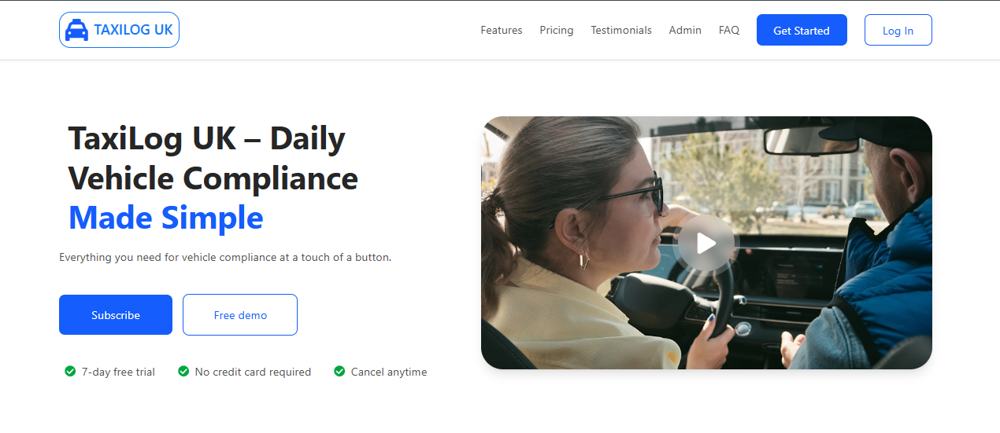

# 🚖 Fleet Management System

> Your ultimate car, taxi booking and property management platform.

## 🌟 Overview

TAXILOG UK is a modern, full-stack platform offering seamless taxi booking services and property management. Built with React and Node.js, it provides an intuitive interface for both users and administrators.

## ⚡ Quick Start

```bash
# Install dependencies
npm install

# Run development server
npm run dev

# Build for production
npm run build
```

## 🛠️ Tech Stack

### Frontend
- 
- 
- 
- 

## 🎯 Key Features

- 🔐 Secure Authentication & Authorization
- 👤 User Dashboard
  - Profile Management
  - Booking History
  - Saved Properties
- 👑 Admin Dashboard
  - User Management
  - Property Overview
  - Booking Analytics
- 💳 Stripe Payment Integration
- 🌍 Multi-language Support
- 📱 Responsive Design

## 🗂️ Project Structure

```
src/
├── assets/          # Static assets
├── components/      # Reusable components
├── layout/          # Layout templates
├── pages/          # Page components
├── router/         # Route configurations
└── utils/          # Utility functions
```

## 💡 Environment Variables

```env
VITE_API_URL=your_api_url
VITE_STRIPE_KEY=your_stripe_key
```

## 📜 Git Commit Convention

| Type | Description |
|------|-------------|
| feat | New feature |
| fix | Bug fix |
| docs | Documentation |
| style | Formatting |
| refactor | Code restructuring |
| test | Testing |
| chore | Maintenance |
